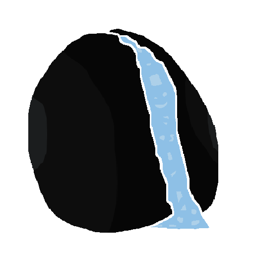

  
   
  <small><i>made by my friend, men</i></small>
    
  <h1>MachiOS</h1>
  
<strong>mochiOS based linux distro</strong>

  

    
    
    
  

---

## about

machiOS doesn't do anything

## features

| feature | what it does |
|---|---|
| **os** | doesn't work |
## desktop environments

